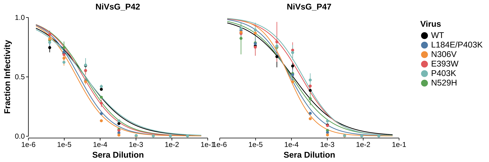

# Snakemake pipeline to fit and plot neutralization curves
Plot neutralization curves with Altair

This snakemake pipeline uses the [neut_curve](https://jbloomlab.github.io/neutcurve/) package to fit neutralization curves to data and [Altair](https://altair-viz.github.io/) to plot the results. It parses the name of the file to automatically determine if the data are serum, antibody, or receptor selections, and also if it should be faceted.



## Installation and Usage
clone the repository
```bash
git clone https://github.com/bblarsen-sci/snakemake_neuts_altair.git
```

Then run the pipeline with snakemake
```bash
./run_pipeline.bash
```
or if on a cluster
```bash
sbatch run_pipeline.bash
```

An environment file defining minimum packages required to run the pipeline is also included in the repository. To create the environment, run
```bash
conda env create -f environment.yml
```

The pipeline works by reading any `.csv` files in `/data` and generates plots and a `.csv` of the fit paramaters in `/results`.

**Important**
The pipeline runs by parsing the name of the `.csv` file placed in `/data`. Valid strings it recognizes are:
- 'serum' will assume you are working with serum and adjust labels
- 'antibody' will assume you are working with antibodies and adjust to be in µg/mL scale
- 'receptor' will assume you are working with receptors and adjust to be in µM scale
- 'facet' if facet is in the name, it will facet the plots 

Finally, if 'WT' is somewhere in the 'virus' column, it will assume you are comparing mutants to a WT virus and place the WT first in the legend and force it to be a black line.

## Data format
The data should be in a csv file with the following columns. Note 'serum', is used generally here, it could be an antibody or receptor, or anything that neutralizes virus.
- serum: the serum name
- virus: the virus name
- replicate: the replicate number
- concentration: the concentration of serum/antibody/etc.
- fraction infectivity: the fraction of infectivity at that concentration

Here is an example of the first few lines of a valid csv file

| serum | virus | replicate | concentration | fraction infectivity |
|-------|-------|-----------|---------------|----------------------|
| bEFNB2_5min | NiV | 1 | 10 | 1.29E-05 |
| bEFNB2_5min | NiV | 1 | 3.3333 | 1.08E-05 |
| bEFNB2_5min | NiV | 1 | 1.1111 | 1.64E-05 |
| bEFNB2_5min | NiV | 1 | 0.3704 | 1.83E-05 |
| bEFNB2_5min | NiV | 1 | 0.1235 | 3.08E-05 |

## Customization
There are a few parameters that can be adjusted in [/config/config.yml](/config/config.yml).

The remainder of the plot customization comes from a custom Altair [theme](https://github.com/bblarsen-sci/altair_themes), which can be modified as necessary.

## Examples
Examples of data and output are in [/data](/data/) and [/results](/results) respectively.